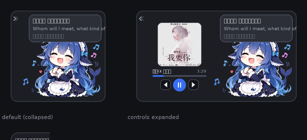

# dsh-whalegirl-lyric

鲸鱼娘·洛雪歌词挂件 —— 一个 [DSH](https://deepwiki.com/lyswhut/lx-music-desktop) Web GUI 插件：把当前播放的歌词以**会话气泡**样式显示在唱歌的鲸鱼娘旁边，并提供播放控制。

功能对位同工作区的 `LyricDisplay`（PyQt5 桌面浮窗），但跑在 DSH Web GUI 里。



## 功能

- 停在 GUI 右下角，不遮挡会话内容（整体刻意压小）
- **三种形态**：默认收起 → 展开控制区（点 `‹`）→ 收成胶囊（点 `×`）
- **默认收起**：只显示鲸鱼娘那一块（约 198px 宽），左侧控制区整列不占位
- **右上角气泡**（与鲸鱼娘头部同侧）显示当前歌词，尾巴朝下指向她的头，切句时有升起动画
- 气泡内依次显示：当前歌词（最多两行）→ 翻译歌词 → 下一句预览
- **控制区**（展开后）：歌曲封面、歌曲名、进度条、上一首 / 播放暂停 / 下一首
- 歌曲名超长时**来回滚动**（实测溢出量决定距离与时长），悬停暂停
- 鲸鱼娘播放时轻微浮动，暂停时静止并降低饱和度
- **可拖动**：按住卡片空白处或鲸鱼娘拖动，位置记入 localStorage，松手后自动夹在视口内
- 折叠状态、收起状态、拖动位置都记入 localStorage，且**多窗口同步**
- 明暗主题都跟随 `--dsw-*` 设计令牌，不写死颜色

## 安装

### 方式一：按包名安装（已发布到 npm）

```sh
pnpm add dsh-whalegirl-lyric
```

然后在 profile 的 `package.json` 里把包名加入 bundle 列表：

```json
{ "dsh": { "profile": { "bundles": ["...", "dsh-whalegirl-lyric"] } } }
```

> **`bundles` 里必须有一项**，否则包的 `cordis.patch.yml` 不会被应用、插件行不会插入 Loader 树。
> 症状是「文件都在，插件却没反应」。

### 方式二：从本地源码安装

在 profile 目录（`~/.dsh/profiles/<名称>/`）：

1. 把本包**复制**进 `node_modules/`
2. 在 `package.json` 里声明依赖并加入 bundle 列表：

```json
{
  "dependencies": { "dsh-whalegirl-lyric": "file:<本包绝对路径>" },
  "dsh": { "profile": { "bundles": ["...", "dsh-whalegirl-lyric"] } }
}
```

开发时用仓库里的同步脚本，避免忘掉复制这一步：

```sh
node build/sync-profile.mjs              # 同步到默认 profile（desktop）
node build/sync-profile.mjs <profile 名>  # 指定 profile
node build/sync-profile.mjs --dry-run    # 只看会复制什么
```

3. **重启 DeepSeek Harness**，然后刷新浏览器页面。

> **为什么第 1 步必须「复制」而不能用软链接 / junction？**
>
> Node 的 ESM 解析器**默认解析符号链接的 realpath**。若用 junction 指向源码目录，
> `import 'schemastery'` 会去**源码所在仓库**的 `node_modules` 链里找，而那里没有这个包。
> 报错里的路径指向仓库而不是 profile，极易误判为插件写错：
>
> ```
> Cannot find package 'schemastery' imported from
> D:\...\plugins\dsh-whalegirl-lyric\lib\index.js    ← 是仓库路径，说明走了 realpath
> ```
>
> 因此必须复制实体目录 —— profile 里其他插件（`@deepseek-ai/*`、`@linxin666/*`）也都是实体目录。

> **不要从插件源码目录直接 `import` 测试。** 插件依赖 `schemastery`（校验配置 schema 用），
> 它由**宿主运行时**提供，只存在于 profile 的 `node_modules` 下：
>
> ```sh
> # 在插件源码目录里这样做会失败：
> node -e "import('./lib/index.js')"
> #   Error: Cannot find package 'schemastery'
>
> # 必须装进 profile 后，从 profile 目录导入：
> cd <profile 目录>
> node -e "import('dsh-whalegirl-lyric').then(m => console.log(m.Config({})))"
> ```
>
> 这一点容易误导排查：看到 `Cannot find package` 很可能以为插件写错了，其实只是没装在宿主里。
> （发布到 npm 时 `schemastery` 已声明为 `dependency`，所以按包名安装时它会被一并装上。）

> `dsh.profile.bundles` 里的名字既用于解析包，也用于应用该包 `dsh.bundle.patch` 指向的 patch 文件 —— 后者负责把插件行插入 Loader 树。
>
> **不要**再往 profile 自己的 `cordis.patch.yml` 里手写同样的 insert：两处都写会在重启时重复插入同一行。

## 配置

在 **设置 →「插件」** 页里找到 `dsh-whalegirl-lyric`，点配置即可编辑。字段由 Host 侧 Config schema（schemastery）直接投影成表单，**保存后 Loader 会用新配置重新挂载条目，无需重启**。

| 字段 | 默认 | 范围 | 说明 |
|------|------|------|------|
| `host` | `127.0.0.1` | 字符串 | 洛雪音乐开放 API 地址。填远程地址前请确认对方已开启该服务 |
| `port` | `23330` | ≥ 0 的整数 | 洛雪音乐开放 API 端口（见洛雪「设置 → 基本设置 → 开放 API」） |
| `lyrics` | `true` | 布尔 | 在气泡里显示歌词 |
| `translation` | `true` | 布尔 | 同时显示翻译歌词（取不到时自动回退为只显原文） |
| `pollIntervalMs` | `500` | 200 ~ 5000 | 状态轮询间隔（毫秒）。越短歌词越跟手，请求也越频繁 |
| `useSse` | `true` | 布尔 | 用 SSE 推送即时响应切歌与播放/暂停（官方推荐）。设为 `false` 则只靠轮询 |

也可以直接写进 `cordis.patch.yml`：

```yaml
- insert:
    - id: whalegirl-lyric
      name: 'dsh-whalegirl-lyric'
      config:
        host: 127.0.0.1
        port: 23330
        lyrics: true
        translation: true
        pollIntervalMs: 500
        useSse: true
```

非法值会被 schema 直接拒绝（例如 `port: -1`、`pollIntervalMs: 100`），并在表单里报错。

## 架构

```
洛雪音乐开放 API (127.0.0.1:23330)
        │
        ├── SSE 推送 /subscribe-player-status   ← 切歌、播放/暂停**即时**到达
        │      （只在状态变化时推送，进度不逐帧来）
        │
        └── 轮询 /status（每 pollIntervalMs）   ← 提供权威进度基准
               │
               ▼
Host 半边 lib/index.js
  ├── controller.js   双来源状态机、切歌时抓 /lyric(-all)、本地进度外推、端点映射
  ├── lrc.js          LRC 解析（1~3 位小数、`.` 与 `:` 分隔、同行多标签、offset）
  └── 两条路由（都在命名空间根路径上）：
        GET  /api/dsh-whalegirl-lyric/state     状态快照（含当前句/下一句/翻译）
        GET  /api/dsh-whalegirl-lyric/state?cover=<url>   当前歌曲封面的同源代理
        POST /api/dsh-whalegirl-lyric/control   播放控制
        │
        ▼
Client 半边 lib/client.js（静态 bundle，零构建依赖）
  └── 注册进 shell.overlay 插槽，300ms 读一次状态并渲染
```

**为什么轮询放在 Host 侧**：洛雪音乐的开放 API 不返回 CORS 头，浏览器直接请求会被同源策略拦掉；同时放在 Host 侧意味着多个页面共享同一次轮询与同一条 SSE。

### SSE 与轮询的分工

两者**都要有**，缺一不可：

| 机制 | 负责 | 为什么不能省 |
|------|------|--------------|
| SSE `/subscribe-player-status` | 切歌、播放/暂停**即时**反应 | 纯轮询最多要等一个周期才切歌 |
| 轮询 `/status` | 权威**进度**基准 | SSE 只在状态变化时推送，进度不逐帧来，光靠它进度条会一顿一顿 |

两条来源共用一个 `applyStatus()`。注意它做的是**合并**而非整体替换 —— SSE 每帧只带变化的字段，整体替换会让一次 `progress` 推送把歌名、时长清空。

SSE 用 **`fetch` 流式读取**实现，不用 `EventSource`：Host 侧原生支持 fetch 流，无需额外依赖，也便于带着 `AbortSignal` 随插件卸载一起中止。断线（洛雪重启等）按 2 秒重连，`stop()` 时不会重连。

### 洛雪端点（均已实测）

官方[开放 API 文档](https://lxmusic.toside.cn/desktop/open-api)与实测结果**不完全一致**，以下是实测结论：

| 端点 | 实测 | 用途 |
|------|------|------|
| `/status?filter=...` | 200 | 播放状态；**不带 `lyric`**（整首歌词约 2.4KB，改由歌词端点取） |
| `/lyric` | 200，纯文本 LRC | 原文歌词 |
| `/lyric-all` | 200，JSON | `{ lyric, tlyric, rlyric, lxlyric }`，需要翻译时走这个一次拿全 |
| `/play` `/pause` | 200 | 播放 / 暂停 |
| `/skip-next` `/skip-prev` | 200 | 下一曲 / 上一曲 —— **不是** `/next` `/prev` |
| `/tlyric` `/rlyric` `/lxlyric` | **401** | **不存在**；早期版本误用过 `/tlyric` |
| `/subscribe-player-status` | **长连接** | SSE 状态推送流 —— 本插件已接入（见「SSE 与轮询的分工」） |
| `/seek?offset=<秒>` | 200 | 调整播放进度 ⚠️ **写操作** |
| `/volume?volume=<1-100>` | 200 | 调整音量 ⚠️ **写操作** |
| `/mute?mute=<true/false>` | — | 静音开关 ⚠️ **写操作** |

> ⚠️ **探测端点时注意**：`/seek`、`/volume`、`/mute` 是写操作，用 `curl` 盲目探测会**真的改变播放状态**
> （开发时就因为发了一次 `/seek?offset=0` 把正在听的歌拖回了开头，`/volume?volume=50` 改了音量）。
> 只读探测请只用 `/status`、`/lyric`、`/lyric-all`。

端点映射集中在 `lib/controller.js` 的 `PlayerController.CONTROL_ENDPOINTS`，改端点只需改这一处。
`/seek` 与 `/volume` 目前**未接入 UI**（进度条不可点、无音量控件）。

### 为什么封面要经 Host 代理

洛雪返回的 `picUrl` 指向第三方图床（酷狗 / QQ 音乐等）。浏览器直接加载会带上本站 `Referer`，容易被防盗链拒绝；由 Host 侧中转后是同源请求，且 Host 不发送浏览器 `Referer`。

代理**复用已有的 `/state` 路由 + 查询参数**，没有新增子路径 —— 因为 DSH 只放行 `/api/<命名空间>/<名字>` 这一层，任何多一层路径段（实测 `/api/<ns>/assets/x.png`、`/api/<ns>/media/x.json`）都会返回 **401**。

准入条件：只代理**当前歌曲自己**的 `picUrl`，避免把路由变成任意 URL 的开放代理。封面字节在内存里按 URL 缓存，同一首歌只回源一次。

### 为什么素材是内嵌的 data URL

承接上一条：既然素材无法通过子路径路由提供，构建脚本就把裁剪后的鲸鱼娘编码成 data URL 注入 bundle。副作用是插件**完全自包含**，不依赖任何外部文件。

## 界面细节

### 关键尺寸

| 元素 | 默认（收起） | 展开控制区 |
|------|--------------|------------|
| 卡片 | **约 198 × 186** | 约 324 × 186 |
| 控制区 | 不占位（`visibility:hidden` + 宽度 0） | 126 × 170（内宽 110） |
| 封面 | 隐藏 | 90 × 90，水平居中 |
| 歌曲名 | 隐藏 | 110 宽居中（超长滚动） |
| 进度区 | 隐藏 | 上排「已播 —— 总时长」110 宽，下排 110 宽通栏进度条 |
| 舞台区 | 160 × 170 | 160 × 170（**收起时尺寸不变**） |
| 气泡 | 148 宽 | 148 宽（**收起时尺寸不变**） |

宽度账（`padding:8`、`gap:8`、折叠开关列 14 且左外边距 −5）：

```
展开：8 + 14 − 5 + 8 + 126 + 8 + 160 + 8 = 327
收起：8 + 14 − 5 + 8 + 160 + 8           = 193
```

收起时只是把左侧整列收掉，**鲸鱼娘与气泡不被拉伸、在屏幕上的位置也不变** —— 挂件锚定右下角，卡片是从左边收回来的。

### 两条必须守住的布局约束

这两条都是踩过坑之后写的，且各自有测试断言守着：

**1. 任何一行都不能超过控制列内宽（110）。** 一旦超过，flex 行会溢出列边界，视觉上直接盖住鲸鱼娘 —— 这就是「进度条漫过左侧区域」那次现象的原因。因此进度条写作 `flex:none; width:110px`，**不参与弹性伸缩**（弹性伸缩会让内部百分比填充 `width:%` 的基准漂移）。

**2. 时间不能放在进度条左右两侧。** 两个时间标签约 46px，加上进度条共约 160px，远超列内宽。正确布局是**上下两排**：时间行（`justify-content:space-between`）在上，通栏进度条在下。

垂直预算（控制列 170）：封面 90 + 间隙 4 + 歌曲名 14 + 间隙 4 + 时间行 10 + 间隙 3 + 进度条 3 + 间隙 4 + 按钮 26 = 158，余 12px。**封面高度受这条预算约束**，想再放大必须先加高舞台/卡片。

### 超长歌曲名滚动

歌曲名容器固定 110 宽、`overflow:hidden`；内层 `.dshWg_trackScroll` 在**实际溢出时**才开启滚动（`data-scroll="true"`），来回滚动（`animation-direction: alternate`），悬停暂停。

滚动距离不写死 —— 组件用 `scrollWidth - clientWidth` 实测溢出量，再通过 CSS 变量注入：

```
--dshWgMarqueeDx   = -溢出量(px)              → @keyframes dshWgMarquee 的位移目标
--dshWgMarqueeDur  = max(10, 溢出量/26*2) 秒
```

这样中英文、粗体与否都算得准，歌名变化后重新测量。

### 拖动实现

位移写进两个 CSS 变量，叠加在默认右下角间距之上：

```css
right:  calc(var(--dshWgRight, 0px)  + 12px);
bottom: calc(var(--dshWgBottom, 0px) + 12px);
```

用 `calc` 叠加而不是直接改 `right`，是为了让「默认位置」在 CSS 里保持可读、可断言。

拖动期间**直接改 DOM 的 CSS 变量、不触发重渲染**（否则每帧要重算整棵子树），松手才落盘并回填状态。偏移量是「离右下角的距离」，因此**与鼠标位移方向相反**（鼠标向左上移动 → 偏移增大）。

## 开发

```
build/
  client.template.js   客户端源码（手写，含 __WHALEGIRL_DATA_URL__ 占位符）
  build.mjs            构建：裁剪素材留白 → 缩放到 400px → base64 → 注入模板
  preview.py           用 Pillow 按 CSS 真实尺寸画预览图
lib/
  client.js            构建产物（bundle，不要手改）
  index.js             Host 半边入口（Config schema + 路由）
  controller.js        播放状态控制器 + 端点映射
  lrc.js               LRC 解析
```

改完客户端源码后：

```sh
node build/build.mjs      # 生成 lib/client.js
python build/preview.py   # 生成 build/preview.png（可选，改布局时很有用）
```

然后把 `lib/`、`build/`、`README.md` 同步到 profile 的 `node_modules/dsh-whalegirl-lyric/`，再重启。

> **必须重启**：实测外置插件不在 HMR 监听范围内 —— 改 `lib/*.js` 或替换 `client.js` 都不会热更新（客户端 bundle 只能通过 `rebuilt()` 钩子进图，而插件目录没有构建监听器）。

### 为什么客户端不用 TSX / ESM import

DSH 的客户端 bundle 是 **CJS factory 模型**，由 `window.__ModuleLoader__.load({ id, factory })` 自注册，`factory(require)` 里的 `require` 针对外壳的**平台模块表**（`react`、`react/jsx-runtime`、`@deepseek-ai/cordis` 等）解析。因此：

- 手写 `React.createElement`，不依赖 JSX 编译
- **只 `require("react")`** —— 不用 `react-dom`（它不在平台表里，`require` 会抛错并导致整个插件加载失败）
- 用原生 DOM API 注入样式与动画

## 测试

三套验证脚本（都存在 DSH home 下），改完代码建议全部跑一遍：

| 脚本 | 覆盖 | 断言数 |
|------|------|--------|
| `_verify_host.mjs` | LRC 解析、真实 API 集成、端点映射、轮询间隔回退、翻译开关 | 30 |
| `_verify_client.mjs` | bundle 自注册、插槽注册、组件渲染、三态布局、宽度/垂直预算、滚动、拖动 | 119 |
| `_verify_config.mjs` | Config 默认值、非法值拒绝、导出契约 | 17 |
| `_verify_sse.mjs` | SSE 帧解析（注释行/CRLF/多行 data/类型收敛）、合并语义、真实订阅与 stop() 退出 | 28 |

客户端测试的做法：在 Node 里**忠实复刻**运行时契约 —— stub 出 `window.__ModuleLoader__`、React（含跨渲染的状态保持与 effect 重跑语义）、DOM（含文档级事件）、fetch —— 然后把真实生成的 bundle 跑起来。这样能在不重启 GUI 的前提下验证绝大部分行为。

尺寸类断言**从 CSS 里解析实际值**而非硬编码，因此调尺寸不会误报，但会守住「展开 ≤400、默认 ≤260、高度 ≤260」这几条上限。

## 故障排查

### 安装类

| 现象 | 原因与处理 |
|------|-----------|
| 按包名安装报 404 / 找不到包 | 本插件需已发布到 npm。未发布时只能走本地源码安装（见「安装」） |
| 用 junction / 软链接装，报 `Cannot find package 'schemastery'` | Node 解析软链接的 realpath，去了仓库目录找宿主依赖。**必须复制实体目录** |
| 装好后插件毫无反应，文件都在 | `package.json` 的 `dsh.profile.bundles` 里漏了本包名 → patch 未应用、插件行未插入 Loader 树 |
| 装好后重启仍不出现 | 确认重启了 **DeepSeek Harness 本体**（不是只刷新页面）；Host 侧改动必须重启 |
| 插件管理器安装报 `ERR_PNPM_UNEXPECTED_STORE` | profile 的 `node_modules` 由**旧版 pnpm** 安装（如 pnpm 10），而运行时自带 pnpm 11。两个大版本的 store 格式不兼容（索引从 JSON 变为 SQLite），且 pnpm 11 强制使用自己的 `store/v11`，**无法靠 `store-dir` 配置绕过**。处理：用当前运行时的 pnpm 重装 profile 依赖 |

### 运行类

| 现象 | 原因与处理 |
|------|-----------|
| 挂件完全不出现 | 浏览器 F12 看 Console 是否有 `[dsh-whalegirl-lyric]` 报错；确认已重启 + 硬刷新（Ctrl+Shift+R） |
| 只看到右下角一个小胶囊 | 之前点过 `×` 收起了。状态存在 localStorage，**重装不会清除**。点胶囊展开，或删掉 `dsh-whalegirl-lyric:hidden` 后刷新 |
| 气泡显示「未连接到洛雪音乐」 | 洛雪没开开放 API，或 `host`/`port` 配置不对。先 `curl http://127.0.0.1:23330/status` 确认 |
| 上一首 / 下一首无反应 | 端点必须是 `/skip-prev` `/skip-next`。写成 `/next` `/prev` 会静默拿到 401 |
| 歌词只有一行「纯音乐，请欣赏」 | 该曲目本身是纯音乐，没有歌词。换一首有人声歌词的歌即可，不是 bug |
| 歌词卡住不动 | 检查 LRC 是否含单位小数时间标签（如 `[00:09.6]`）；解析器已覆盖 1~3 位小数 |
| 封面显示占位方块 | 图床防盗链或网络失败。封面代理已做同源中转与单首缓存，仍失败则退化为占位 |
| 翻译歌词一直为空 | 歌曲本身没有翻译，或该曲源的 `tlyric` 为空；可关掉 `translation` 省一次请求 |
| 改了配置不生效 | 保存后 Loader 会重挂条目；若无效请确认改的是插件条目的 config，而不是别处 |

### 排查用的 localStorage 键

插件把界面状态记在这三个键里，**重装插件不会清除**，排查「看不到挂件」时先看它们：

```
dsh-whalegirl-lyric:hidden    = '1' → 收成了胶囊
dsh-whalegirl-lyric:compact   = '1' → 控制区收起（这是默认值）
dsh-whalegirl-lyric:pos       → 拖动位置
```

在浏览器 Console 里：

```js
// 查看当前状态
Object.fromEntries(Object.entries(localStorage).filter(([k]) => k.includes('whalegirl')))

// 恢复默认显示
Object.keys(localStorage).filter(k => k.includes('whalegirl')).forEach(k => localStorage.removeItem(k));
location.reload()
```

## 已知限制

- 只支持洛雪音乐（LX Music）的开放 API，且需在其设置里开启（默认端口 23330）
- 进度条依赖服务端进度 + 本地时间外推，seek 后最多一个轮询周期才对上
- 折叠 / 收起 / 拖动位置都存在 localStorage，**每台浏览器独立**（多窗口之间会同步，跨设备不会）
- 只使用原文与翻译歌词；`rlyric`（罗马音）、`lxlyric`（Any Listen 逐字）暂未展示
- `/seek` 与 `/volume` 端点可用但**未接入 UI**：进度条不可点击定位，也没有音量控件
- SSE 断线后固定 2 秒重连，没有指数退避

## 许可

代码采用 [MIT](LICENSE) 许可。

> ⚠️ 插件中的角色形象来自仓库根目录的 `whalegirl.png`（构建时裁剪并内嵌为 data URL），
> 该插画为**第三方素材**，著作权不属于本项目作者，**不在 MIT 授权范围内**。
> 再分发或商用前请自行取得原作者许可，详见仓库根目录的 [NOTICE](../../NOTICE)。
